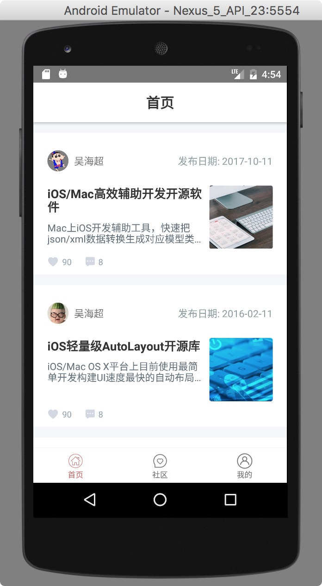
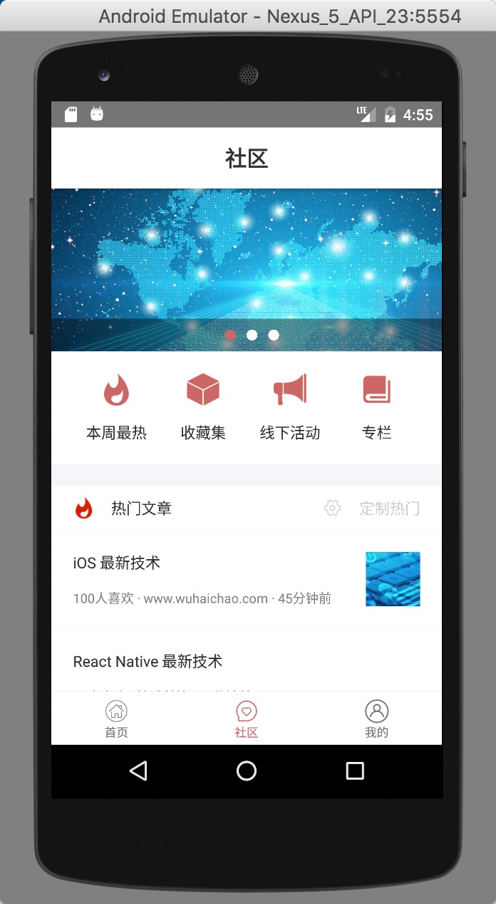
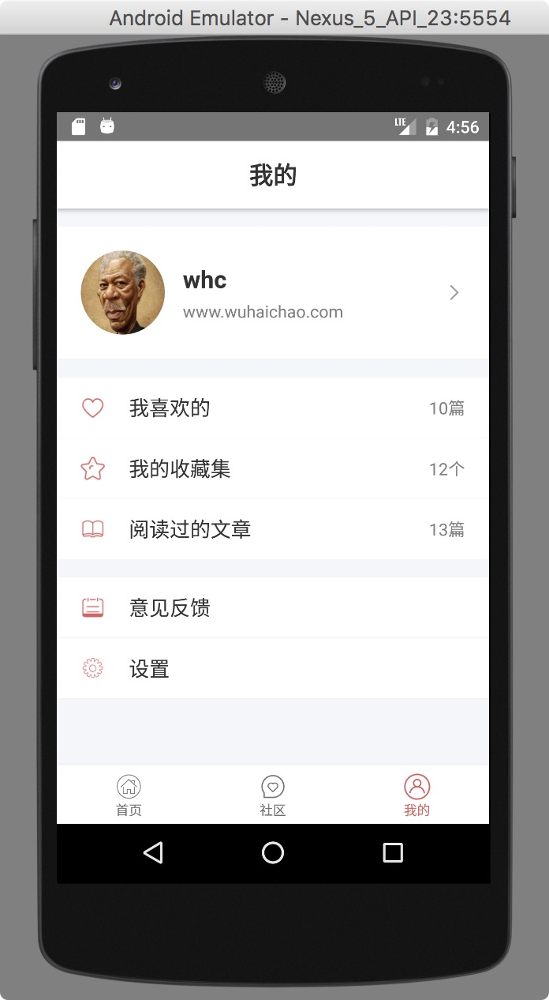

# react-native whcapp

[](https://raw.githubusercontent.com/attentiveness/whcapp/master/LICENSE)

Provide learning advice for learning react-native development

A complete react-native app with complete data interaction capabilities.

**android版本体验: **[https://fir.im/whcandroid](https://fir.im/whcandroid)

**ios版本体验(内测): **[https://fir.im/whcandroid](https://fir.im/whcios)

**app所使用数据接口文档地址：**[http://www.wuhaichao.com/api_doc/](http://www.wuhaichao.com/api_doc/)

**个人网站：**[http://www.wuhaichao.com](http://www.wuhaichao.com)

**Support: Android 5+   iOS 8.0+**

## App Architecture

```
"react": "16.0.0-beta.5",
"react-native": "0.49.5",
"react-navigation": "1.0.0-beta.19",
"react-redux": "^5.0.5",
"redux": "^3.7.2",
"redux-thunk": "^2.2.0"
```

## Screenshot




## Development

### Step One

```
npm install -g react-native-cli
```
### Step Two

```
npm install
```
### Step Three

```
react-native start
```
### Step Four

```
react-native run-ios
react-native run-android
```

## Contributing

Any good Suggestions or questions to ask or email

## License

Apache License 2.0
