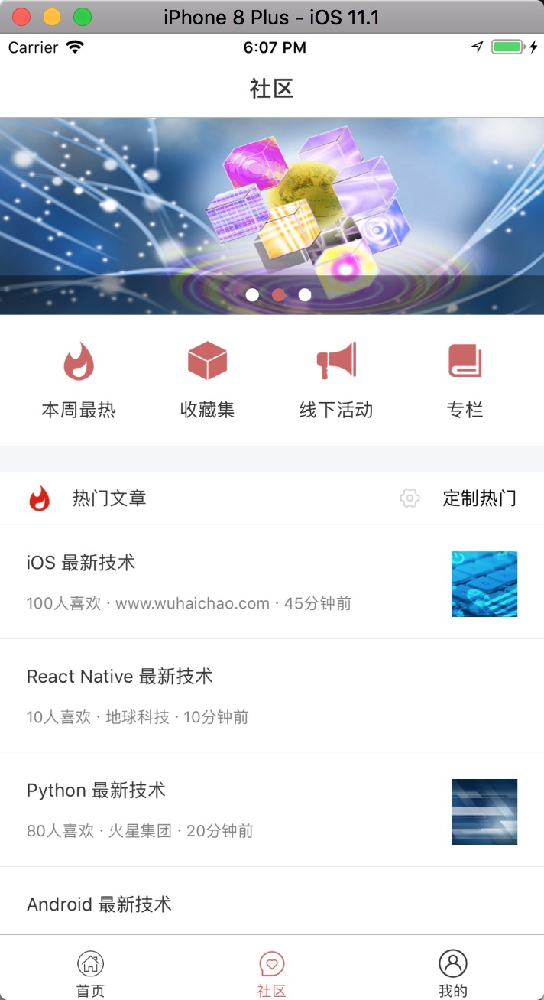

# react-native whcapp

[](https://raw.githubusercontent.com/attentiveness/whcapp/master/LICENSE)

Provide learning advice for learning react-native development

**Support: Android 5+   iOS 8.0+**

## App Architecture

```
"react": "16.0.0-beta.5",
"react-native": "0.49.5",
"react-navigation": "1.0.0-beta.19"
```

## Screenshot



## Development

### Step One

```
npm install -g react-native-cli
```
### Step Two

```
npm install
```
### Step Three

```
react-native start
```
### Step Four

```
react-native run-ios
react-native run-android
```

## Contributing

Any good Suggestions or questions to ask or email

## License

Apache License 2.0
